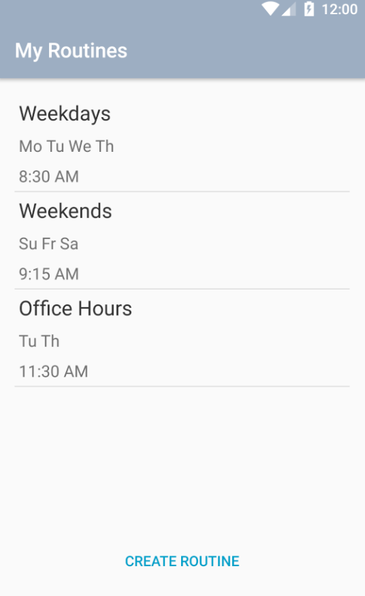
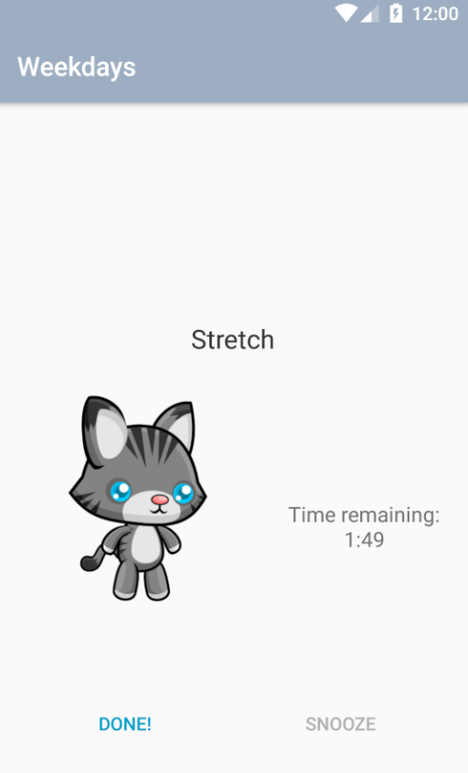
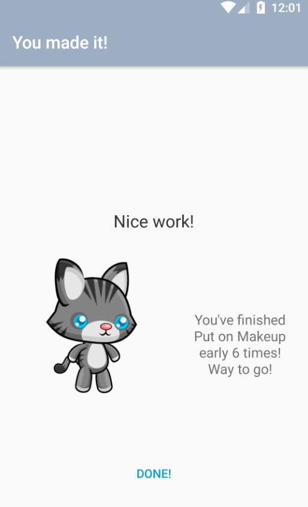

# Routina
Routina is a routine management app for Android, originally designed for people with ADHD to help them create and manage their routines. A friendly creature named Tina will provide encouragement and support, even giving friendly suggestions for when routines should change to adjust to one's habits.

Routina uses [https://firebase.google.com/](Firebase) and [https://get.fabric.io/](Fabric). It is designed for accessibility.

